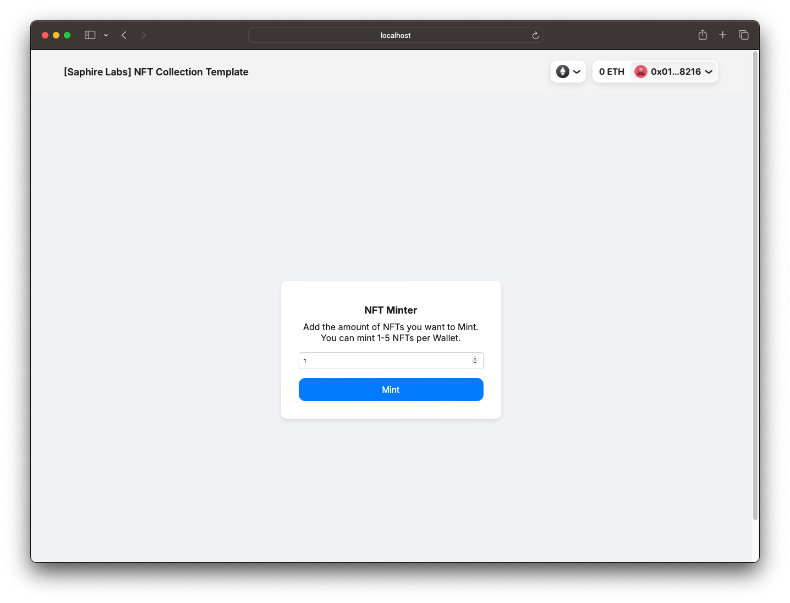
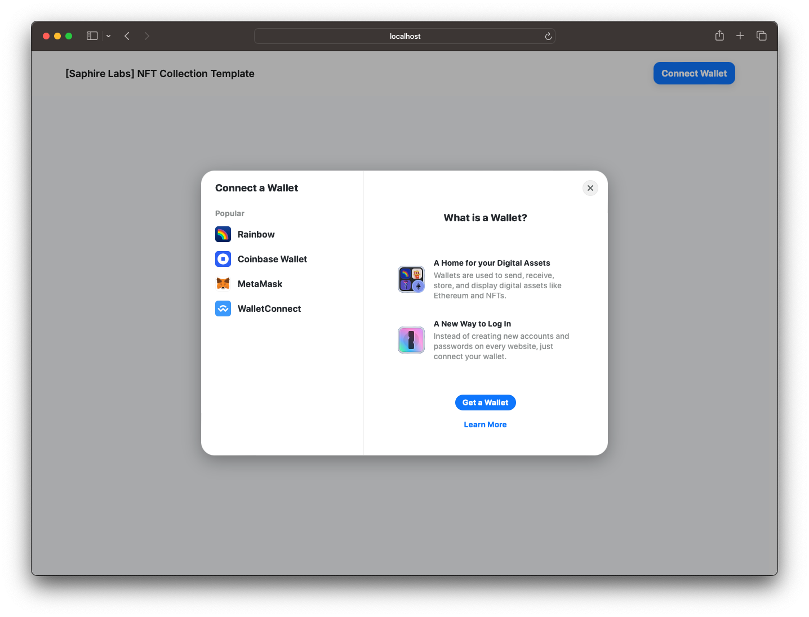

# ERC-721 NFT Collection Template [Saphire Labs]

This project is a decentralized application (DApp) template for minting NFTs (Non-Fungible Tokens) on the Ethereum blockchain. The application is built using Solidity for the smart contract, Truffle for development and deployment, and React.js for the frontend interface. This template provides a starting point for developers to create their own NFT collection DApp.



## Table of Contents

- [Prerequisites](#prerequisites)
- [Installation](#installation)
- [Configuration](#configuration)
- [Compiling Contracts](#compiling-contracts)
- [Deploying Contracts](#deploying-contracts)
- [Running the Frontend](#running-the-frontend)
- [Testing the Contracts](#testing-the-contracts)
- [Setting Up Ganache and MetaMask](#setting-up-ganache-and-metamask)
- [Interacting with the DApp](#interacting-with-the-dapp)
- [Customizing the Smart Contract](#customizing-the-smart-contract)
- [Frontend Configuration](#frontend-configuration)
- [License](#license)
- [Acknowledgements](#acknowledgements)
- [Contact](#contact)

## Prerequisites

Make sure you have the following installed on your machine:

- [Node.js](https://nodejs.org/) (version 14.x or later)
- [npm](https://www.npmjs.com/) (version 6.x or later)
- [Truffle](https://www.trufflesuite.com/) (version 5.x or later)
- [Ganache](https://www.trufflesuite.com/ganache) (for local development)

You also need a MetaMask wallet or any other Ethereum wallet to interact with the DApp.

## Installation

1. **Clone the repository:**

   ```bash
   git clone <repository-url>
   cd nft-collection
   ```

2. **Install dependencies:**

   ```bash
   npm install
   cd client
   npm install
   cd ..
   ```

## Configuration

1. **Create a `.env` file:**

   In the root directory, create a `.env` file and add your environment variables:

   ```plaintext
   MNEMONIC="your mnemonic phrase here"
   INFURA_PROJECT_ID="your Infura project ID here"
   ETHERSCAN_API_KEY="your Etherscan API key here"
   ```

2. **Update `truffle-config.js`:**

   Ensure the `truffle-config.js` is set to compile contracts to the correct directory:

   ```javascript
   const HDWalletProvider = require("@truffle/hdwallet-provider");
   require("dotenv").config();

   module.exports = {
   	contracts_build_directory: "./client/src/contracts",

   	networks: {
   		development: {
   			host: "127.0.0.1",
   			port: 8545,
   			network_id: "*",
   		},
   		mainnet: {
   			provider: () =>
   				new HDWalletProvider({
   					mnemonic: process.env.MNEMONIC,
   					providerOrUrl: `https://mainnet.infura.io/v3/${process.env.INFURA_PROJECT_ID}`,
   					numberOfAddresses: 1,
   					shareNonce: true,
   				}),
   			network_id: 1,
   			gas: 5500000,
   			gasPrice: 20000000000,
   			confirmations: 2,
   			timeoutBlocks: 200,
   			skipDryRun: true,
   		},
   		ropsten: {
   			provider: () =>
   				new HDWalletProvider({
   					mnemonic: process.env.MNEMONIC,
   					providerOrUrl: `https://ropsten.infura.io/v3/${process.env.INFURA_PROJECT_ID}`,
   					numberOfAddresses: 1,
   					shareNonce: true,
   				}),
   			network_id: 3,
   			gas: 5500000,
   			confirmations: 2,
   			timeoutBlocks: 200,
   			skipDryRun: true,
   		},
   	},

   	mocha: {},

   	compilers: {
   		solc: {
   			version: "0.8.19",
   			settings: {
   				optimizer: {
   					enabled: true,
   					runs: 200,
   				},
   			},
   		},
   	},

   	plugins: ["truffle-plugin-verify"],

   	api_keys: {
   		etherscan: process.env.ETHERSCAN_API_KEY,
   	},

   	db: {
   		enabled: false,
   	},
   };
   ```

## Compiling Contracts

1. **Compile the smart contracts:**

   ```bash
   truffle compile
   ```

## Deploying Contracts

1. **Deploy the smart contracts to the development network:**

   Ensure Ganache is running, then deploy the contracts:

   ```bash
   truffle migrate --reset --network development
   ```

2. **Deploy to other networks:**

   To deploy to Ropsten or Mainnet, ensure your `.env` file is correctly configured with your Infura and mnemonic details, then run:

   ```bash
   truffle migrate --network ropsten
   ```

   or

   ```bash
   truffle migrate --network mainnet
   ```

## Running the Frontend

1. **Start the React development server:**

   ```bash
   cd client
   npm start
   ```

2. **Open your browser:**

   Navigate to `http://localhost:3000` to interact with the DApp.

## Testing the Contracts

The project includes a suite of tests to ensure that the smart contracts function as expected. These tests are written using the Truffle framework and are located in the `test` directory.

1. **Run the smart contract tests:**

   ```bash
   truffle test
   ```

2. **Understanding the Tests:**

   - **Minting Tokens:**
     The tests verify that tokens can be minted correctly, starting from token ID 1.

     ```javascript
     it("should mint a new token starting from ID 1", async () => {
     	const instance = await NFTCollection.deployed();
     	const initialBalance = await instance.balanceOf(accounts[0]);

     	await instance.mint(1, {
     		from: accounts[0],
     		value: web3.utils.toWei("0.05", "ether"),
     	});

     	const finalBalance = await instance.balanceOf(accounts[0]);
     	assert.equal(
     		finalBalance.toNumber(),
     		initialBalance.toNumber() + 1,
     		"Balance should increase by 1"
     	);

     	const tokenId = await instance.tokenOfOwnerByIndex(accounts[0], 0);
     	assert.equal(tokenId.toNumber(), 1, "Token ID should be 1");
     });
     ```

   - **Exceeding Maximum Supply:**
     The tests ensure that the total supply of tokens does not exceed the maximum limit.

     ```javascript
     it("should not exceed MAX_SUPPLY", async () => {
     	const instance = await NFTCollection.deployed();
     	let exceeded = false;

     	try {
     		await instance.mint(10001, {
     			from: accounts[0],
     			value: web3.utils.toWei("500.05", "ether"),
     		});
     	} catch (e) {
     		exceeded = true;
     	}

     	assert.equal(
     		exceeded,
     		true,
     		"Should not be able to mint more than MAX_SUPPLY"
     	);
     });
     ```

   - **Withdraw Funds:**
     The tests confirm that the contract owner can withdraw funds from the contract.

     ```javascript
     it("should allow the owner to withdraw funds", async () => {
     	const instance = await NFTCollection.deployed();
     	const initialOwnerBalance = web3.utils.toBN(
     		await web3.eth.getBalance(accounts[0])
     	);

     	await instance.withdraw({ from: accounts[0] });

     	const finalOwnerBalance = web3.utils.toBN(
     		await web3.eth.getBalance(accounts[0])
     	);
     	assert(
     		finalOwnerBalance.gt(initialOwnerBalance),
     		"Owner balance should increase after withdraw"
     	);
     });
     ```

   - **Limit Per User:**
     The tests ensure that a user cannot mint more than the allowed number of tokens.

     ```javascript
     it("should not allow more than 5 tokens per user", async () => {
     	const instance = await NFTCollection.deployed();
     	let exceeded = false;

     	try {
     		await instance.mint(6, {
     			from: accounts[1],
     			value: web3.utils.toWei("0.3", "ether"),
     		});
     	} catch (e) {
     		exceeded = true;
     	}

     	assert.equal(
     		exceeded,
     		true,
     		"Should not be able to mint more than 5 tokens per user"
     	);
     });

     it("should allow up to 5 tokens per user", async () => {
     	const instance = await NFTCollection.deployed();
     	const initialBalance = await instance.balanceOf(accounts[2]);

     	await instance.mint(5, {
     		from: accounts[2],
     		value: web3.utils.toWei("0.25", "ether"),

     ```

});

     	const finalBalance = await instance.balanceOf(accounts[2]);
     	assert.equal(
     		finalBalance.toNumber(),
     		initialBalance.toNumber() + 5,
     		"Balance should increase by 5"
     	);
     });
     ```

These tests help ensure the robustness and correctness of the smart contract. It's important to run the tests after making any changes to the contract to verify that everything works as expected.

## Setting Up Ganache and MetaMask

1. **Download and Install Ganache:**

   - [Ganache](https://www.trufflesuite.com/ganache) is a personal blockchain for Ethereum development. Download and install Ganache from the Truffle Suite website.

2. **Start Ganache:**

   - Open the Ganache app.
   - Click on "Quickstart Ethereum" to create a new workspace.
   - Note the RPC server address (usually `http://127.0.0.1:7545`).

3. **Configure MetaMask:**

   - Install the [MetaMask](https://metamask.io/) browser extension.
   - Open MetaMask and click on the network dropdown at the top.
   - Select "Custom RPC".
   - Enter the following details:
     - Network Name: Ganache
     - New RPC URL: `http://127.0.0.1:7545`
     - Chain ID: 1337 (Ganache default)
     - Currency Symbol: ETH
     - Block Explorer URL: (leave blank)
   - Click "Save".

4. **Import Accounts to MetaMask:**

   - In Ganache, click on the key icon next to an account to view the private key.
   - Copy the private key.
   - In MetaMask, click on the account icon, then "Import Account".
   - Paste the private key and click "Import".

You are now connected to your local Ganache blockchain with MetaMask. You can interact with your DApp using the accounts provided by Ganache.

## Interacting with the DApp

1. **Connect Wallet:**

   - Open the DApp in your browser.
   - Click on the "Connect Wallet" button to connect your MetaMask wallet.

2. **Mint NFT:**

   - Once connected, you can mint an NFT by clicking the "Mint" button.
   - Ensure you have sufficient ETH in your wallet to cover the minting fee.

3. **Check Total Supply:**

   - The total supply of minted NFTs will be displayed on the main page.

## Customizing the Smart Contract

The `NFTCollection.sol` smart contract contains several variables that you can customize to suit your specific needs:

1. **MAX_SUPPLY**:

   - The maximum number of NFTs that can be minted.
   - Default value: `10000`.
   - Example: To set the maximum supply to 5000, change:
     ```solidity
     uint256 public constant MAX_SUPPLY = 10000;
     ```
     to
     ```solidity
     uint256 public constant MAX_SUPPLY = 5000;
     ```

2. **PRICE**:

   - The price of each NFT in ether.
   - Default value: `0.05 ether`.
   - Example: To set the price to 0.1 ether, change:
     ```solidity
     uint256 public constant PRICE = 0.05 ether;
     ```
     to
     ```solidity
     uint256 public constant PRICE = 0.1 ether;
     ```

3. **MAX_MINT_PER_USER**:

   - The maximum number of NFTs a single user can mint.
   - Default value: `5`.
   - Example: To set the maximum mint per user to 10, change:
     ```solidity
     uint256 public constant MAX_MINT_PER_USER = 5;
     ```
     to
     ```solidity
     uint256 public constant MAX_MINT_PER_USER = 10;
     ```

4. **Base URI**:

   - The base URI for the NFT metadata.
   - This can be set in the constructor when deploying the contract.
   - Example:

     ```javascript
     const NFTCollection = artifacts.require("NFTCollection");

     module.exports = function (deployer) {
     	deployer.deploy(NFTCollection, "https://base-url.com");
     };
     ```

By customizing these variables, you can tailor the smart contract to meet the specific requirements of your NFT collection project.

## Frontend Configuration

The frontend is built using React.js and utilizes RainbowKit for wallet connection and ethers.js for interacting with the Ethereum blockchain. Here are the steps to configure and run the frontend:



1. **Install React dependencies:**

   Ensure you have installed all necessary dependencies in the `client` directory:

   ```bash
   cd client
   npm install
   ```

2. **Set up RainbowKit and ethers.js:**

   Note by RainbowKit: Every dApp that relies on WalletConnect now needs to obtain a projectId from [WalletConnect Cloud](https://cloud.walletconnect.com/). This is absolutely free and only takes a few minutes.

   In your `index.js`, configure RainbowKit and ethers.js as follows:

   ```javascript
   // src/index.js
   import React from "react";
   import ReactDOM from "react-dom/client";
   import App from "./App";

   import "@rainbow-me/rainbowkit/styles.css";
   import {
   	getDefaultConfig,
   	RainbowKitProvider,
   } from "@rainbow-me/rainbowkit";
   import { WagmiConfig } from "wagmi";
   import { mainnet } from "wagmi/chains";
   import { QueryClientProvider, QueryClient } from "@tanstack/react-query";

   const config = getDefaultConfig({
   	appName: "Test App",
   	projectId: "your_project_id", // Add your RainbowKit project ID here
   	chains: [mainnet],
   	ssr: false, // If your dApp uses server side rendering (SSR)
   });

   const queryClient = new QueryClient();

   const root = ReactDOM.createRoot(document.getElementById("root"));
   root.render(
   	<React.StrictMode>
   		<WagmiConfig config={config}>
   			<QueryClientProvider client={queryClient}>
   				<RainbowKitProvider coolMode>
   					<App />
   				</RainbowKitProvider>
   			</QueryClientProvider>
   		</WagmiConfig>
   	</React.StrictMode>
   );
   ```

3. **Running the Frontend:**

   Start the React development server:

   ```bash
   cd client
   npm start
   ```

   Open your browser and navigate to `http://localhost:3000` to interact with the DApp.

## License

This project is licensed under the MIT License. See the [LICENSE](LICENSE) file for details.

## Acknowledgements

- [OpenZeppelin](https://openzeppelin.com/) for their awesome library of secure smart contracts.
- [Truffle](https://www.trufflesuite.com/) for the development framework.
- [MetaMask](https://metamask.io/) for the Ethereum wallet.
- [Infura](https://infura.io/) for the Ethereum API.
- [RainbowKit](https://www.rainbowkit.com/) for the best way to connect a wallet.
- [Wagmi](https://wagmi.sh/) for reactivity for Ethereum apps.
- [Ethers](https://ethers.org/) for Javascript library for all our Ethereum needs.

## Contact

For any questions or inquiries, please contact info@saphirelabs.com or steve@saphirelabs.com.
